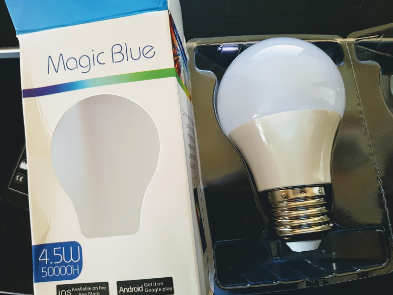

# Module Qt5 pour Magic Blue LED

La [Magic Blue LED](https://fr.gearbest.com/smart-light-bulb/pp_230349.html) est une ampoule LED E27 à intensité variable pilotable en Bluetooth BLE pour environ 10 euros :



## Installation

Le module `QtMagicBlueLed` dépend l’API Qt Bluetooth Low Energy. Elle a été introduite dans Qt 5.4. Depuis Qt 5.5, cette partie de l’API est définitive et une garantie de compatibilité est donnée pour les versions futures. Depuis Qt 5.7, une API supplémentaire prenant en charge le rôle de périphérique a été ajoutée, avec le backend implémenté pour Linux/BlueZ, iOS et macOS.

Il faut donc au moins Qt 5.7 :

```sh
$ sudo apt-get install libqt5bluetooth5 libbluetooth-dev qtconnectivity5-dev qtconnectivity5-examples
```

Télécharger le code source du module Qt5 :

```sh
$ wget -c https://github.com/tvaira/qtmagicblueled/archive/refs/heads/main.zip
```

Ou cloner le projet :

```sh
$ git clone https://github.com/tvaira/qtmagicblueled.git
```

Puis :

```sh
$ cd qtmagicblueled/

$ qmake

$ make

$ sudo make install
```

_Remarques :_

- vous pouvez modifier la version de Qt dans `.qmake.conf`
- vous pouvez préciser le chemin de `qmake` si besoin

## Utilisation

Voir : [Exemple](https://github.com/tvaira/qtmagicblueled/tree/main/examples/MagicBlueLedClient)

Pour utiliser le module Qt `MagicBlueLed`, il faudra commencer par l'ajouter dans le fichier de projet `.pro` :

```
QT += magicblueled
```

L'ampoule se pilote à partir d'un objet de la classe `QMagicBlueLedClient` :

```cpp
#ifndef MAINWINDOW_H
#define MAINWINDOW_H

#include <QMainWindow>
#include <QMagicBlueLedClient>

class MainWindow : public QMainWindow
{
    Q_OBJECT

public:
    MainWindow(QWidget *parent = 0);
    ~MainWindow();

private:
    QMagicBlueLedClient *magicBlueLedClient;

public slots:
    void magicBlueLedUpdated();
    void serviceCommande();
    void serviceEtat();
    void etatChanged(const QByteArray &datas);
};

#endif // MAINWINDOW_H
```

Quelques exemples :

```cpp
#include "mainwindow.h"
#include "qmagicblueled.h"
#include <QDebug>

MainWindow::MainWindow(QWidget *parent)
    : QMainWindow(parent)
{
    magicBlueLedClient = new QMagicBlueLedClient(this);

    connect(magicBlueLedClient, SIGNAL(magicBlueLedUpdated()), this, SLOT(magicBlueLedUpdated()));
    connect(magicBlueLedClient, SIGNAL(serviceCommandeUpdated()), this, SLOT(serviceCommande()));
    connect(magicBlueLedClient, SIGNAL(serviceEtatUpdated()), this, SLOT(serviceEtat()));
    connect(magicBlueLedClient, SIGNAL(etatChanged(const QByteArray &)), this, SLOT(etatChanged(const QByteArray &)));

    magicBlueLedClient->rechercher();
}

MainWindow::~MainWindow()
{
    if(magicBlueLedClient->estConnecte())
        magicBlueLedClient->eteindre();
}

void MainWindow::magicBlueLedUpdated()
{
    if(magicBlueLedClient->estDetecte())
    {
        QList<MagicBlueLed*> liste = magicBlueLedClient->getMagicBlueLed();
        for (int i = 0; i < liste.size(); ++i)
        {
            qDebug() << Q_FUNC_INFO << liste[i]->nom() << liste[i]->adresseMAC();
            magicBlueLedClient->connecter(liste[i]->adresseMAC());
        }
    }
}

void MainWindow::serviceCommande()
{
    if(magicBlueLedClient->etatServiceCommande())
    {
        magicBlueLedClient->allumer();
        // Exemples :
        magicBlueLedClient->commanderRGB(127, 20, 80); // en couleur
        //magicBlueLedClient->commander(20); // en blanc
    }
}

void MainWindow::serviceEtat()
{
    if(magicBlueLedClient->etatServiceEtat())
        magicBlueLedClient->lireEtat();
}

void MainWindow::etatChanged(const QByteArray &datas)
{
    if(datas[0] == (char)0x66 && datas[11] == (char)0x99)
    {
        if(datas[QMagicBlueLedClient::DeviceType] == QMagicBlueLedClient::RBGW_Bulb_New)
            qDebug() << Q_FUNC_INFO << "RBGW_Bulb_New";
        else if(datas[QMagicBlueLedClient::DeviceType] == QMagicBlueLedClient::RGB)
            qDebug() << Q_FUNC_INFO << "RGB";
        else if(datas[QMagicBlueLedClient::DeviceType] == QMagicBlueLedClient::RBGW_UFO)
            qDebug() << Q_FUNC_INFO << "RBGW_UFO";
        else
            qDebug() << Q_FUNC_INFO << "Type inconnu !";
        if(datas[QMagicBlueLedClient::On_Off] == QMagicBlueLedClient::ON)
            qDebug() << Q_FUNC_INFO << "Allumee";
        else
            qDebug() << Q_FUNC_INFO << "Eteinte";
        qDebug() << Q_FUNC_INFO << "LedVersionNum" << (unsigned int)datas[QMagicBlueLedClient::LedVersionNum];
        qDebug() << Q_FUNC_INFO << "Red" << (unsigned int)datas[QMagicBlueLedClient::Red];
        qDebug() << Q_FUNC_INFO << "Green" << (unsigned int)datas[QMagicBlueLedClient::Green];
        qDebug() << Q_FUNC_INFO << "Blue" << (unsigned int)datas[QMagicBlueLedClient::Blue];
        qDebug() << Q_FUNC_INFO << "White" << (unsigned int)datas[QMagicBlueLedClient::White];
    }
}
```

## Voir aussi

- [Mise en oeuvre du Bluetooth BLE sous Qt](http://tvaira.free.fr/bts-sn/activites/activite-ble/activite-ble-qt.html#bluetooth-le-et-qt5)
- [Qt QML/Android](http://tvaira.free.fr/bts-sn/activites/activite-ble/activite-magic-ble-qt-android.html)
- [Android BLE SDKDemo](https://github.com/ZNEGGE-SDK/Android_BLE_SDKDemo)
- [IOS BLE SDKDemo](https://github.com/ZNEGGE-SDK/IOS_BLE_SDKDemo)

---
2018-2021 Thierry Vaira : **[tvaira(at)free(dot)fr](tvaira@free.fr)**

